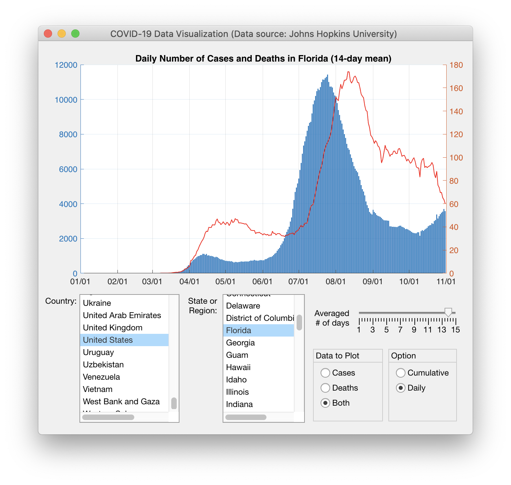

# Proyecto Final - PYTHON INTERMEDIO

## Objetivos de aprendizaje

- Que el participante domine las bases de la programación en Python.
- Que el participante tenga conocimientos elementales sobre la lectura de archivos, procesamiento de datos, y visualización de datos.
- Que el participante pueda encontrar y aplicar conocimientos que vayan más allá de los explicados en el curso.
- Que el participante tenga una experiencia de aplicación de la programación Python a un ejemplo práctico.

## Recomendaciones 

El programa debe ser robusto, es decir, con pocas probabilidades de fallar al alterar sus opciones. El programa no debe *crashear, sino manejar la situación acordemente. Una estrategia para detectar posibles fallos es imaginarse que una persona esta empeñada en producir un error en su programa y pensar: ¿Qué intentaría esta persona para romper el código?* Esto involucra, por ejemplo, contemplar casos en que el usuario seleccione opciones incorrectas, una clave que no se encuentra en un diccionario, un índice mayor al tamaño de una lista, etc.

## Herramientas
- git
- github (utilizar gitignore para proyectos python)
- python 3 
- librerías (pandas, matplotlib, numpy, sympy, etc.)
- **pyqt5** * 
- **QT Designer** *
- slack (chat privado para consultas puntuales)

>En este [enlace](https://www.youtube.com/playlist?list=PL2PZw96yQChwe5ZrLoRjf8kjTYd3KKzKZ) se detallan los pasos para instalar pyqt5 y QT Designer 

## Flujo de Trabajo
1. Clona este repositorio en tu máquina local    
2. Edite los archivos que sean necesarios y complete todas las tareas semanales que se señalan en los entregables.
3. Confirme sus cambios y envíelos a github. 

## Entregables

- **Semana 2:** Selección de tema, lectura de datos, visualización gráficas. Utilizar un archivo de Jupyter (utilizar carpeta notebooks) y las funciones para lectura y visualización los códifica en los modulos de la carpeta `src`. Puede generar los módulos que sean necesarios.

- **Semana 4:**   Implementación de métodos para widgets y diseño de prototipo en QT Designer
  - Revisar [vídeo](https://www.youtube.com/watch?v=865Q41omqPk&list=PLwkJQeEWueTuGaSk2ofa1K5JAuLgtV6x_&index=23&ab_channel=cctmexico) de ejemplo
- **Semana 6:**  Implementación de widgets, pruebas, documentación (actualizar README), defensa de proyecto.

## Organización de carpetas
- img/
- data/
- notebook/
- src/
- main.py

## Instrucciones

El objetivo del proyecto final es sintetizar una serie de conceptos nuevos aprendidos en este curso y aplicarlos en la práctica para resolver un problema del mundo real. Específicamente, deberá utilizar técnicas de programación modular u orientada a objetos y crear una aplicación con una interfaz gráfica de usuario moderna para procesar y visualizar información de una **fuente de datos de su elección**.

### Criterios de revisión

La especificación del problema describe una lista de requisitos sobre la funcionalidad y el enfoque requerido. La calificación se basa en cuántos de los requisitos se satisfacen con la solución dada.

### Instrucciones de asignación paso a paso

El objetivo del proyecto final es crear un programa GUI en PYTHON que procese y visualice los datos de una fuente de datos. 

A continuación se expone 3 opciones para el desarrollo de su proyecto final. 

> Opción 1: **Graficador de casos del COVID-19**

*Análisis y visualización de datos sobre los casos de coronavirus en distintos países.*

En esta era de la desinformación puede resultar útil poder sacar uno mismo sus propias conclusiones acerca de los datos presentados. El objetivo de este trabajo es obtener datos de casos y muertes por el Coronavirus de un repositorio de datos online y graficar por país.

**Funcionalidad:**

- La aplicación debe recibir del usuario el nombre del país deseado y permitir graficar casos detectados y fallecimientos totales para ese país en función del tiempo.

- El usuario debe poder ingresar 2 países y se permite graficar para dichos países la cantidad de casos y fallecimientos en dos gráficos con labels. El usuario debe poder ingresar el intervalo de tiempo a graficar. Calcular las intersecciónes entre gráficos si las hubiera y marcarlas con un punto de algún tipo.

- El usuario debe poder ingresar n países y se permite graficar para dichos países la cantidad de casos en una [escala logaritmica](https://es.wikipedia.org/wiki/Escala_logar%C3%ADtmica). El programa debe pedirle al usuario el intervalo de tiempo deseado.

- Gráficar sobre la misma imagen la cantidad de casos en una escala logaritmica de Ecuador y todos sus países limítrofes (Colombia, Perú, Paraguay, Brasil y Uruguay) durante los meses de invierno (21 de junio a 21 de septiembre). Debe quedar claro la curva que corresponde a cada país.

**Funcionalidad extra:** Pueden realizar todos, algunos, o ninguno de los siguientes ítems. También pueden agregar otra funcionalidad que se les ocurra a ustedes.

- El programa debe permitir almacenar en un archivo excel los países ordenados de mayor cantidad de casos totales acumulados (al día de hoy) a menor cantidad de casos indicando en las distintas columnas el nombre del país, la cantidad de casos y los fallecimientos.

- Almacenar en un archivo excel los países ordenados de mayor cantidad de casos totales acumulados a menor cantidad de casos indicando en las distintas columnas el nombre del país, la cantidad de casos y los fallecimientos colocando en distintas hojas del archivo excel (distintas pestañas) la evolución de este ranking, es decir armar una hoja distinta para cada día transcurrido. Defina los días a utilizar acorde a cuanta información se disponga, podría ser una entrada del usuario.

- Para cada gráfico generado el usuario deberá poder ingresar un nombre de archivo y el programa genera un archivo .PNG del gráfico con el nombre indicado.

**Sugerencia**:

Se pueden rotar las leyendas usando plt.xticks(rotation=60) (rotación de 60 grados). Es útil para leyendas largas, como por ejemplo, fechas.

En esta [página web](https://nexiandigitalacademy.es/visualizacion-y-procesamiento-de-datos-ante-de-la-pandemia-del-covid-19/) hay un ejemplo de gráficos logaritmicos

~~~
!wget 'https://raw.githubusercontent.com/owid/covid-19-data/master/public/data/archived/ecdc/full_data.csv'
~~~

> Opción 2: **Análisis de datos obtenidos por un instrumento de medición**

*Análisis de una señal de un electrocardiograma para conseguir información de un paciente.*

Un electrocardiograma es una representación gráfica de los pulsos cardíacos. Se tiene un archivo **electrocardiograma.xlsx** con la información del resultado de un electrocardiograma en dos columnas, una tiene los valores de las mediciones en $eV$ (columna *señal*), y la segunda los instantes (medido en segundos transcurridos) en que se toma cada medición (columna *tiempo*) que fueron tomadas con una frecuencia de 360 Hz.

**Funcionalidad:**

*   Se debe poder calcular los picos de la señal y marcarlos en un gráfico de la misma.

    **Sugerencia**: Usar la función [scipy.signal.find_peaks](https://docs.scipy.org/doc/scipy/reference/generated/scipy.signal.find_peaks.html) de la librería *scipy* (en la documentación hay ejemplos muy útiles).

*   Se debe poder calcular la frecuencia cardíaca del paciente medida en latidos por minuto a partir de los picos más altos de cada pulsación.

*   Determinar si el electrocardiograma fue tomado mientras el paciente dormía, estaba en reposo o hacia actividad física. Tomar como referencia los [criterios de la frecuencia cardíaca](https://es.wikipedia.org/wiki/Frecuencia_card%C3%ADaca) y pedir como entrada del programa cualquier información adicional necesaria (como la edad o el sexo del paciente).

*   Se deben poder almacenar los resultados en un archivo de texto *.txt*

* Graficar la señal del electrocardiograma en función del tiempo señalando el pico más alto de cada pulsación. Indicar la frecuencia cardíaca dentro del gráfico (puede ser mediante *labels*, *título*, *descripción*, etc).

**Funcionalidad extra:** *Pueden realizar todos, algunos, o ninguno de los siguientes ítems. También pueden agregar otra funcionalidad que se les ocurra a ustedes.*

* Identificar la onda P, el complejo QRS y la onda T para cada pulsación. Pueden investigar más en [esta página de Wikipedia](https://es.wikipedia.org/wiki/Electrocardiograma#El_ECG_normal).

* Analizar y graficar la [densidad espectral de potencia](https://es.wikipedia.org/wiki/Densidad_espectral) de la señal, calcular su valor en 60 Hz (la frecuencia de la instalación eléctrica donde se realizaron las mediciones) para averiguar si la instalación eléctrica afecta a la medición. Para esto pueden utilizar la función [scipy.signal.welch](https://docs.scipy.org/doc/scipy/reference/generated/scipy.signal.welch.html) de la librería *scipy*.
  
  **Atención:** La matemática para hacer este análisis puede resultar avanzada y no es necesario entenderla, alcanza con entender el funcionamiento de las funciones de librería y saber aplicarlas correctamente.

* Para cada gráfico generado el usuario deberá poder ingresar un nombre de archivo y el programa genera un archivo *.PNG* del gráfico con el nombre indicado.

~~~
! wget "https://raw.githubusercontent.com/IEEESBITBA/Curso-Python/master/Curso_Analisis_de_Datos_Datos/electrocardiograma.xlsx"
~~~

___

Siempre que cambie alguno de los widgets de la GUI, el gráfico y su título deben actualizarse de inmediato.

A continuación se muestra una captura de pantalla de una implementación de **ejemplo**. 

Demostración de funcionamiento

  

Tenga en cuenta que tiene flexibilidad para resolver el problema. Solo asegúrese de cumplir con los requisitos anteriores. Puede agregar funciones adicionales si lo desea. 

### Cómo enviar proyecto final:

El repositorio debe actualizarse de forma continua, creando los commits necesarios. Su proyecto debe contener todos los archivos PYTHON necesarios para ejecutar su programa . Normalmente, tendría los siguientes archivos: el archivo principal de la aplicación (.py), el archivo .ui con el diseño de la interfaz, modulos de python con la lógica del programa (carpeta src) y la fuente de datos. Esto último es útil para asegurarse de que se revise su programa con los datos con los que lo probó, se puede actualizar el archivo de datos regularmente a medida que avanza el tiempo. 

